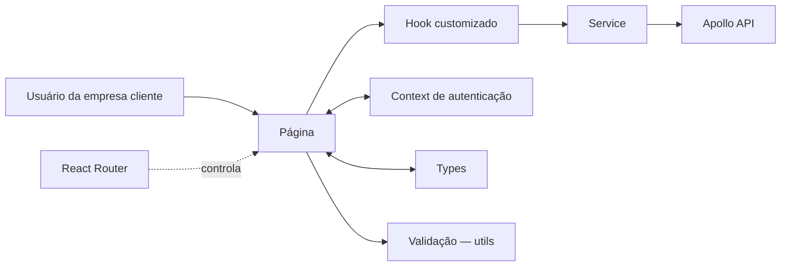

<div align="center">

# 🖥️ Apollo Web

### Interface web da plataforma Apollo

Painel de gestão do ciclo de vida de placas solares — lotes, placas, ordens
de serviço, realocações e funcionários — consumindo a **Apollo API**.

[](https://react.dev/)
[](https://www.typescriptlang.org/)
[](https://vite.dev/)
[](https://reactrouter.com/)
[](LICENSE)

</div>

---

## Sobre o projeto

O **Apollo Web** é a interface de uso da plataforma Apollo — um serviço de
gestão de ativos fotovoltaicos licenciado a empresas industriais que possuem
e operam suas próprias placas solares. Cada empresa cliente contrata o
Apollo e passa a acessar o sistema com sua própria conta, isolada das
demais.

A aplicação atende três perfis por filial:

- **Gerente de Filial** — perfil de maior alçada no Web. Decide sobre
  alertas e ordens de serviço, aprova ou rejeita realocações entre filiais,
  edita os dados da própria unidade e cadastra, edita e desativa os
  funcionários da filial.
- **Operador** — opera o dia a dia da filial: pré-cadastra lotes de placas
  por upload de planilha, abre ordens de serviço a partir de alertas, e
  sugere realocações.
- **Analista** — acesso somente leitura, com visão completa dos dados da
  filial para acompanhamento e métricas.

Toda a comunicação acontece com a Apollo API por HTTP.

## Arquitetura



```text
src/
├── components/   # design system — um componente por pasta, com index.tsx
├── pages/        # um módulo por pasta, com index.tsx
├── services/     # comunicação com a Apollo API — único lugar com fetch
├── types/        # interfaces de props e entidades, por domínio
├── utils/        # validação e sanitização de formulário
├── hooks/        # hooks customizados com retorno tipado
├── auth/         # Context de autenticação e sessão
└── routes/       # configuração do React Router e rotas privadas
```

## Tecnologias

| Tecnologia | Versão | Uso no projeto |
|---|---|---|
| React | 19 | Biblioteca de interface |
| TypeScript | 6 | Tipagem estática, `strict` ativo |
| Vite | 8 | Build e servidor de desenvolvimento |
| React Router | 7 | Roteamento e rotas privadas |
| ESLint + jsx-a11y | 9 | Análise estática e acessibilidade |

## Como executar

### Pré-requisitos

- Node.js 20.19+ ou 22.12+
- A **Apollo API** em execução (veja o README do back-end)

```bash
node -v
npm -v
```

> Não use `&`, acentos, nem pastas do OneDrive/Google Drive/Dropbox no
> caminho do projeto — quebram o `cmd.exe`, ferramentas sem suporte a UTF-8,
> e o `node_modules`, respectivamente. Prefira `C:\dev` ou `~/dev`.

### 1. Clone o repositório

```bash
git clone https://github.com/ApolloOficial/Apollo-Web.git
cd Apollo-Web
npm install
```

### 2. Configure as variáveis de ambiente

```bash
cp .env.example .env      # macOS e Linux
copy .env.example .env    # Windows
```

### 3. Execute a aplicação

```bash
npm run dev       # servidor de desenvolvimento em http://localhost:5173
npm run build     # build de produção
npm run preview   # testa localmente a build de produção
npm run lint      # verifica as regras de ESLint
```

Rode `npm run build` e `npm run lint` antes de abrir Pull Request — erro de
tipo não aparece no `dev`, só na build.

## Variáveis de ambiente

| Variável | Padrão local | Descrição |
|---|---|---|
| `VITE_API_URL` | `http://localhost:8080/api/v1` | Base da Apollo API |

Toda variável usada no código precisa do prefixo `VITE_` para o Vite expor ao
front, e é lida com `import.meta.env.VITE_NOME`. O `.env` está no
`.gitignore` e **nunca** deve ser versionado.

## Módulos

| Rota | Módulo | Descrição |
|---|---|---|
| `/welcome` | Boas-vindas | Tela de entrada, antes do login |
| `/login` | Login | Autenticação dos funcionários da filial |
| `/` | Início | Visão geral da filial |
| `/alerts` | Alertas | Central de alertas — Gerente e Operador decidem se abrem uma OS |
| `/service-orders` | OS | Abertura, aprovação e acompanhamento de ordens de serviço |
| `/relocations` | Realocações | Solicitação e aprovação de realocação de placas entre filiais |
| `/branches` | Filiais | Dados da própria filial e dos lotes cadastrados |
| `/employees` | Funcionários | Cadastro, edição e desativação de funcionários — exclusivo do Gerente |
| `/map` | Mapa | Visualização geográfica das filiais |
| `/metrics` | Métricas | Indicadores e dashboards da filial |

O Analista tem acesso somente leitura a todas as telas acima, exceto
Funcionários. Todas as rotas exceto `/welcome` e `/login` exigem sessão ativa
(`PrivateRoute`).

## Regras do projeto

- Nenhum arquivo `.js` ou `.jsx` dentro de `src/` — apenas `.ts` e `.tsx`
- Proibido `any` — `strict` ativo no `tsconfig`
- Proibido `fetch` em componentes ou páginas — sempre via `src/services/`
- Proibido `key={index}` em listas com adição, remoção ou reordenação
- Proibido `window.location.href` — navegação via `<Link>` ou `useNavigate`
- Proibido `<div onClick>` — toda ação usa `<button>`
- Proibido `alert()` ou `console.log` como único feedback de operação assíncrona
- Todo `<input>` precisa de `<label>` associado via `htmlFor`
- Toda imagem precisa de `alt` descritivo, ou `alt=""` quando decorativa

## Convenções

### Commits

[Conventional Commits](https://www.conventionalcommits.org/), em inglês:

```
<tipo>: <descrição no imperativo>
```

| Tipo | Quando usar |
|---|---|
| `feat` | Nova funcionalidade |
| `fix` | Correção de bug |
| `refactor` | Mudança de código sem alterar comportamento |
| `docs` | Documentação |
| `style` | Formatação, sem mudança de lógica |
| `chore` | Configuração, dependências, tarefas de manutenção |

Imperativo, não passado; minúscula depois dos dois-pontos; sem ponto final;
nada de mensagens genéricas como `update` ou `fix bug`.

### Branches

```
<tipo>/<descrição-curta-com-hifens>
```

Ninguém commita direto na `main`. Abra Pull Request, peça revisão de pelo
menos um colega, e só faça merge depois da aprovação.

## Problemas comuns

| Sintoma | Solução |
|---|---|
| `Cannot find module ... vite.js` | Caminho do projeto contém `&` ou acento — mova para `C:\dev` |
| Porta 5173 em uso | `npm run dev -- --port 3000` |
| Erro após trocar de branch | `npm install` — o `package.json` pode ter mudado |
| Variável de ambiente indefinida | Confirme o prefixo `VITE_` e reinicie o servidor |
| Requisição para a API sempre falha | Confirme se `VITE_API_URL` termina em `/api/v1`, não só `/api` |

## Licença

Distribuído sob a licença MIT. Consulte o arquivo [LICENSE](LICENSE) para mais
informações.

---

<div align="center">

Desenvolvido pela equipe **Apollo** para o Projeto Interdisciplinar 2026. 🚀

</div>
